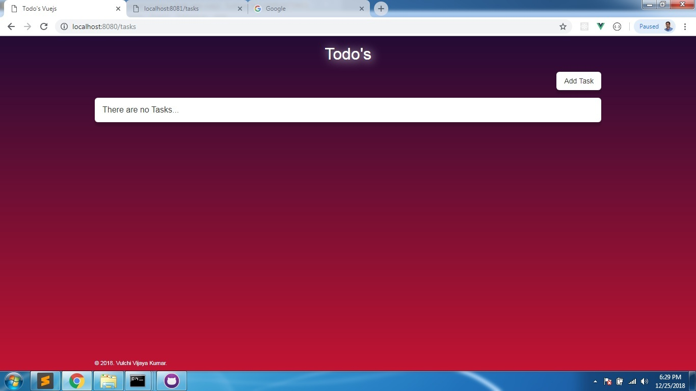
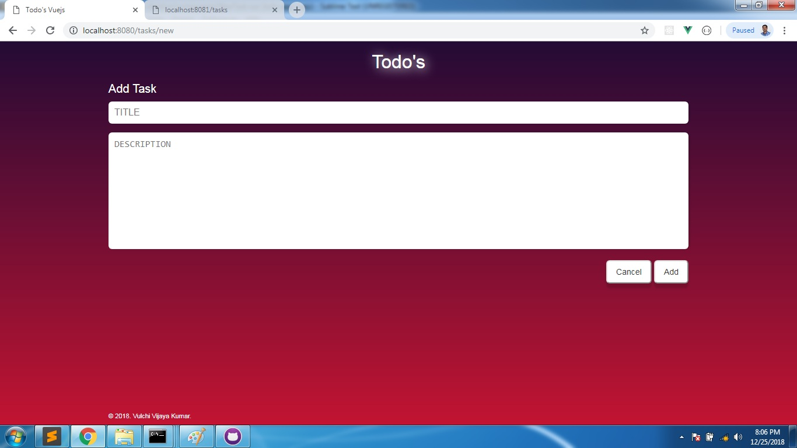
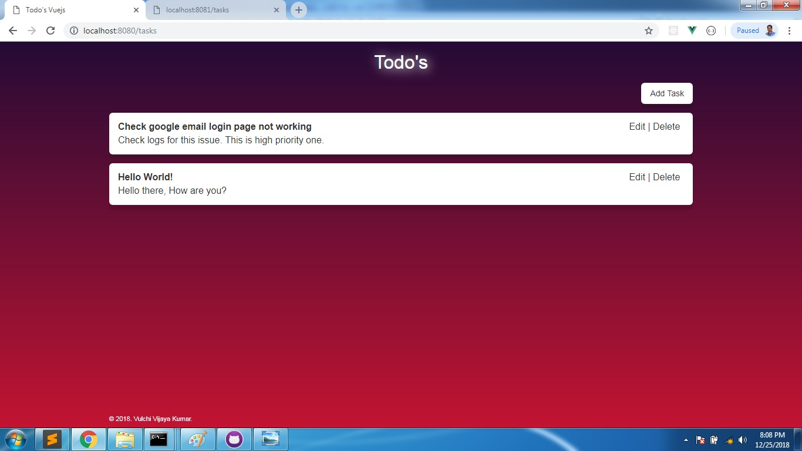
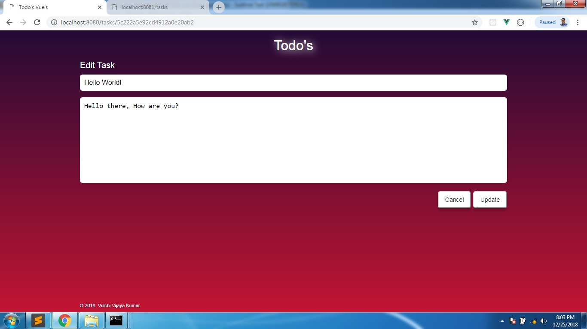
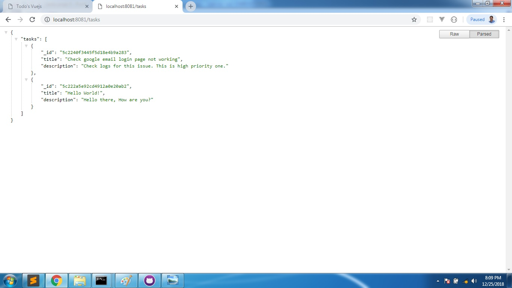

# my-vue-app
Description: Todo application with Vuejs, Expreejs and Mongoose (MongoDB)

> A Vue.js project

## prerequisite

1. Install node if you do not have.
2. Install {>/$} npm install -g vue-cli

## To run App follow below steps

1. Clone this repository
2. ...
3. Frontend view runing here http://localhost:8080
4. Backend runing here http://localhost:8081

## Screenshots

1. Home page

2. Add task page

3. Tasks page

4. Edit task page

5. Backend json page
